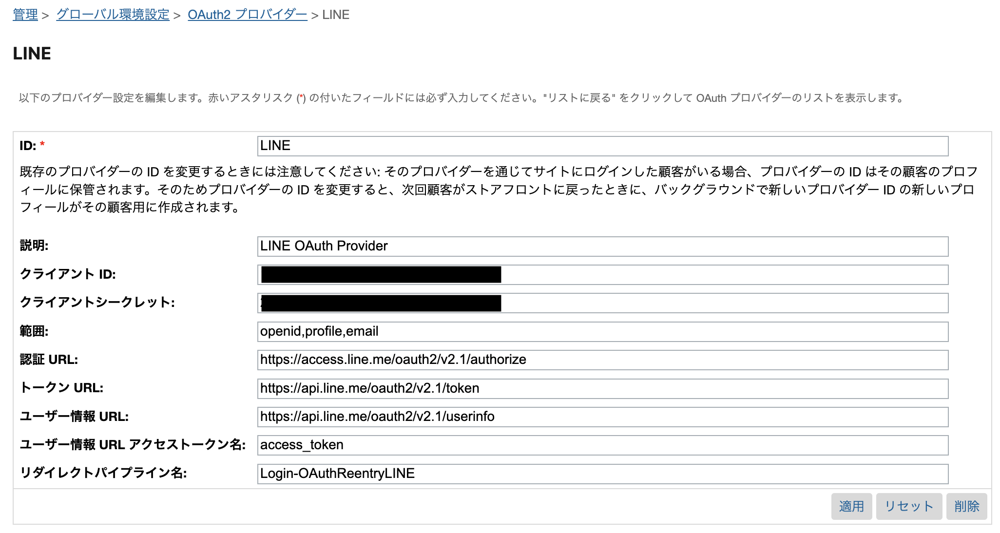

# SFCC B2C OAuth

## Support

### :warning: PLEASE READ BEFORE USING THIS CARTRIDGE :warning: ###

This cartridge is maintained by the **Salesforce Community**. Salesforce Commerce Cloud and Salesforce Platform Technical Support do not support this project or its setup. Enhancements and defect resolution will be driven by the Salesforce Community. You are invited to [log an issue](https://github.com/sandragolden/sfcc-line-oauth/issues/new/choose) or [submit a pull-request](https://github.com/sandragolden/sfcc-line-oauth/compare) to advance this project.

----

## Overview

This cartridge is a proof of concept for integrating Microsoft LINE OAuth with Salesforce Commerce Cloud B2C.

Currently, `dw.customer.oauth.OAuthLoginFlowMgr` does not support passing the access token in the header, which LINE's [UserInfo](https://developers.line.biz/en/reference/line-login/#userinfo) endpoint requires.
Instead of calling `OAuthLoginFlowMgr.finalizeOAuthLogin()`, we will call `OAuthLoginFlowMgr.obtainAccessToken()`,
and then make a custom HTTP call to the [UserInfo](https://developers.line.biz/en/reference/line-login/#userinfo) endpoint.
And also get user email, we need verify idToken, so we make custom HTTP call to the [Verify](https://developers.line.biz/en/reference/line-login/#verify-id-token)

This cartridge also includes an ***optional*** feature to merge external profiles with existing customer accounts. This will ensure if you have existing SFCC shopper accounts, the external profile will be added to the existing account, rather than creating a new customer profile, allowing for order history and profile data to accessed from the same login.

## Cartridge Installation

**Note**: Requires minimum compatibility mode 21.2.

### Install and Upload the Cartridge

1. Clone this repository. The name of the top-level directory is `sfcc-line-oauth`.
2. From the `sfcc-line-oauth` directory, run `npm install`. This command installs all the package dependencies.
3. Create a `dw.json` file in the root directory of the repository. Providing a [WebDAV access key from BM](https://documentation.b2c.commercecloud.salesforce.com/DOC1/index.jsp?topic=%2Fcom.demandware.dochelp%2Fcontent%2Fb2c_commerce%2Ftopics%2Fadmin%2Fb2c_access_keys_for_business_manager.html) in the `password` field is optional, as you will be prompted if it is not provided.
```json
{
    "hostname": "your-sandbox-hostname.commercecloud.salesforce.com",
    "username": "AM username like me.myself@company.com",
    "password": "your_webdav_access_key",
    "code-version": "version_to_upload_to"
}
```
4. Enter the following command: `npm run uploadCartridge`.

For more information on uploading the cartridge, see the following topic on the B2C Commerce Infocenter: [Upload Code for SFRA](https://documentation.b2c.commercecloud.salesforce.com/DOC2/index.jsp?topic=%2Fcom.demandware.dochelp%2Fcontent%2Fb2c_commerce%2Ftopics%2Fsfra%2Fb2c_uploading_code.html).

### Configuration

#### Update Cartridge Path

This plugin requires the `app_storefront_base` cartridge.

1. Log in to Business Manager.
2. Go to **Administration** > **Sites** > **Manage Sites**.
3. Select the site that you want to use LINE Login.
4. Click the **Settings** tab.
5. In the **Cartridges** field, add the new cartridge path: `int_line`. It must be added _before_ the path for `app_storefront_base`. Example path: `int_line:app_storefront_base`

#### Import Main Data

1. Zip the [data/site_template_line](data/site_template_line) folder: `npm run data:zip:main`
2. Go to **Administration** > **Site Development** > **Site Import & Export**.
3. Click **Browse**
4. Select the `site_template_line.zip` file
5. Click **Upload**.
6. Select `site_template_line.zip`
7. Click **Import**.

#### Update OAuth Client ID and Client Secret

For help setting up your LINE Client ID and Client Secret, please refer to the following documenation:
[Integrating LINE Login with your web app](https://developers.line.biz/en/docs/line-login/integrate-line-login/)

Once you have established your `Client ID` and `Client Secret Value`, update the values in Business Manager:
1. Go to **Administration** > **Global Preferences** > **OAuth2 Providers** > **LINE**
2. Update Client ID
3. Update Client Secret
4. Click **Apply**




#### Update Sevice Credentials
For verify idToken, you need specify Client ID to service credential.

1. Go to **Administration** > **Operations** > **Services** > **Service Credentials** > **line.verifyIdToken.cred - Details**
2. Update User by Client ID
3. Click **Apply**


#### Update `enableMergeExternalAccounts` Site Preference (optional)

If you wish to have external accounts merged with SFCC shopper accounts, enable the `enableMergeExternalAccounts` site preference:

1. Go to **Merchant Tools** > **Site Preferences** > **Custom Site Preference Groups**
2. Click the **ExternalAccounts** Label
3. Select **Yes**
4. Click **Save**

## Contributing

### Lint and Build your code

Before committing code to this project, please run the following scripts and ensure they run without error.
1. `npm run lint`

## License

Licensed under the current NDA and licensing agreement in place with your organization. (This is explicitly **not** open source licensing.)

### Support

**This project should not be treated as Salesforce Product.** It is a tool and strategy for B2C projects. Customers and partners implement this at-will with no expectation of roadmap, technical support, defect resolution, production-style SLAs.

This project is maintained by the **Salesforce Community**. Salesforce Commerce Cloud or Salesforce Platform Technical Support do not support this project or its setup.

THE SOFTWARE IS PROVIDED "AS IS", WITHOUT WARRANTY OF ANY KIND, EXPRESS OR IMPLIED.

For feature requests or bugs, please open a [GitHub issue](https://github.com/takahoh/sfcc-line-oauth/issues).
